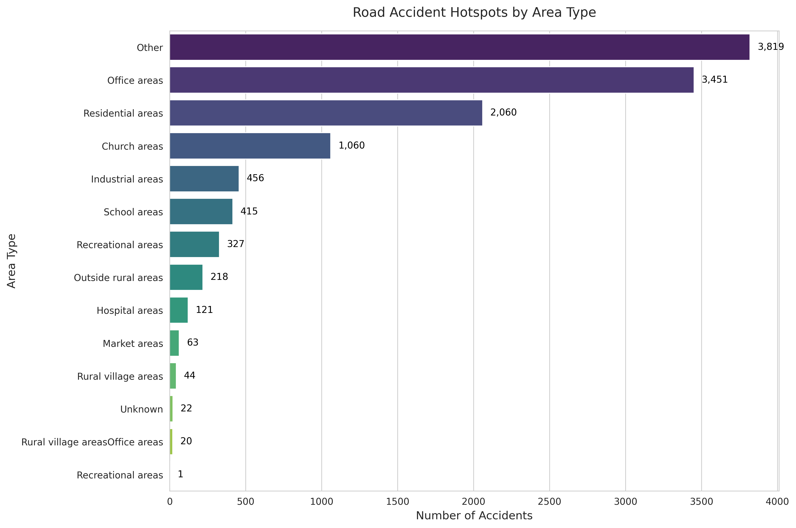
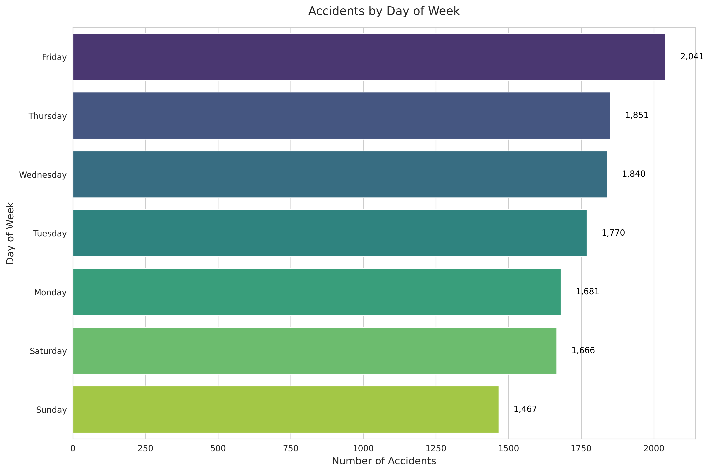
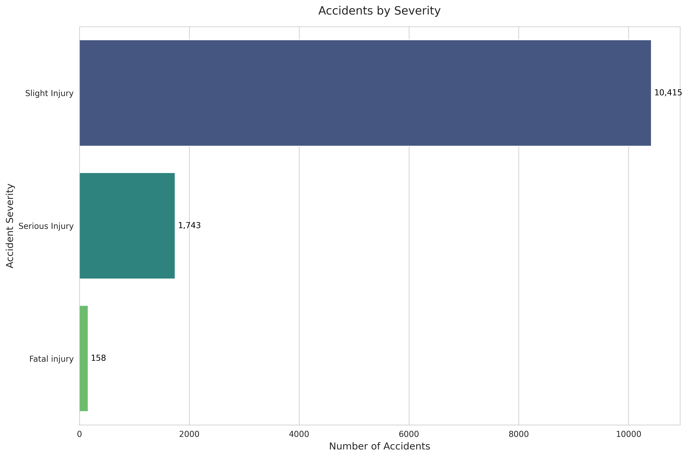

# Mapping Road Accident Hotspots in India
This project analyzes road accident data to identify hotspots by area type, day of the week, and severity. 
## Project Overview
- **Objective**: Identify accident-prone areas in India using a dataset of road accidents.
- **Dataset**: `accidents.csv` (included in the repository, if uploaded).
- **Tools**: Python, pandas, matplotlib, seaborn, Google Colab.

## Visualizations
- **Accident Hotspots by Area Type**:
  
- **Accidents by Day of Week** (if applicable):
  
- **Accidents by Severity** (if applicable):
  

## How to Run
1. Open the notebook `Road_Accident_Hotspots.ipynb` in Google Colab.
2. Upload `accidents.csv` to the Colab environment (if not using a public dataset).
3. Run all cells to generate the visualizations.
4. The output images will be saved as PNG files (`accident_hotspots.png`, etc.).

## Results
The analysis shows that certain area types (e.g., "Other" and "Office areas") have significantly higher accident counts, indicating potential hotspots for targeted interventions.
